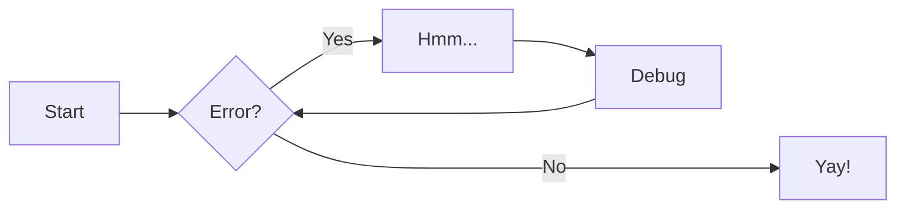
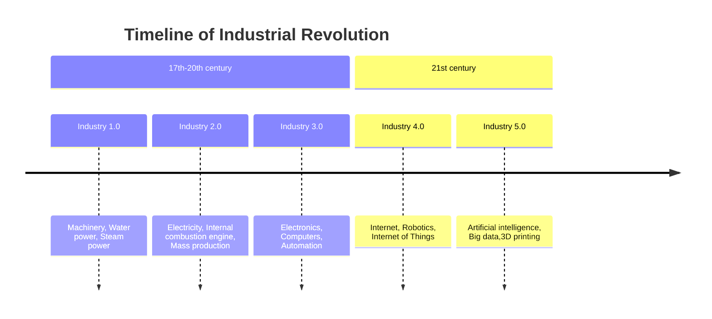

## Welcome  to my page

This is a link to the [idx](index.md)

## Some other section

```gdscript

func _ready() -> void:
	pass
```

[Diagrams video](https://www.youtube.com/watch?v=rXhUeV5Ko7g)




